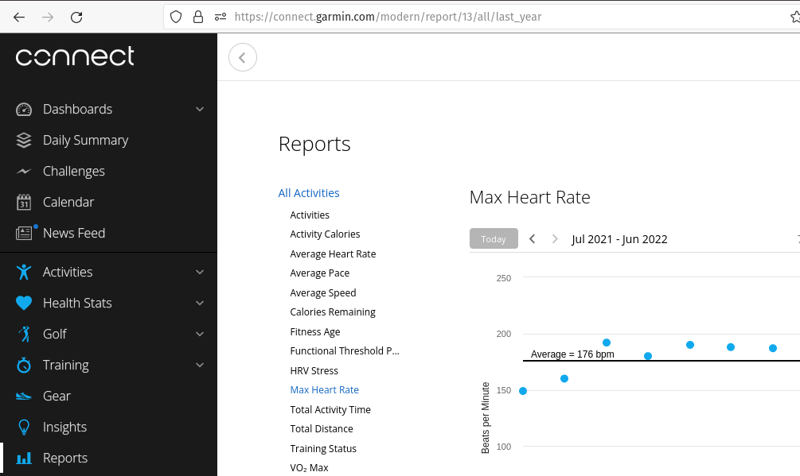

### Heart Rate Zones

To calculate your heart rate zones you will need two numbers, and basic math skills:

1. Your resting heart rate
2. Your maximum heart rate

### Resting heart rate

#### Measuring your resting heart rate

The best time to take your pulse is before you get up in the morning. To get an accurate resting heart rate, take a readings every morning for 3 mornings and divide by 3 to give you an average. You will of course need a watch with a second hand to accomplish this.

Also, as my better looking half just pointed out, you can also use your mobile phone, most of which come with a clock with the ability to measure time.

Your heart rate is the number of times your heart beats per minute (bpm). A normal heart rate is between 60 and 100 bpm while you’re resting.

#### Low resting heart rate (bradycardia)

A low heart rate is classified as a heart rate less than 60 bpm. The medical term for a heart rate of around or less than this is bradycardia.

For some people such as athletes, bradycardia doesn’t pose a health risk. But if you have a low heart rate and are experiencing symptoms like fainting, fatigue and dizziness then you should make an appointment with your GP.

#### Working out you maximum heart rate

The Karvonen formula is one of the bests that can be used to define your heart rate zones and anaerobic threshold. It is based on the heart rate reserve, so it takes into account both your resting heart rate and maximum heart rate. Therefore it gives a much better result than the formulas that use only the maximum heart rate.

Calculating your heart rate zones using the Karvonen formula is very easy and it only takes a few minutes. To use this formula you need to know your resting and maximum heart rates.

After the calculation you will have your heart rate zones and anaerobic threshold that you can apply to your training — the exact meaning and application of the zones and threshold varies with every training plan.

> The bottom line: No matter what type of runner you are--beginner, intermediate, or advanced--a heart-rate monitor will help you train more effectively. We'll show you how. For years, everyone (including us) has been telling you that the best way to find your maximum heart rate (MHR) is to subtract your age from 220. Sorry about that.
>Turns out that's not the most reliable method, at least not for healthy, fit individuals like the readers of Runner's World. For most of you, two newer formulas will prove far more accurate:

__(Formula A)__ MHR = 208 - (0.7 × age)

__(Formula B)__ MHR = 205 - (.5 x your age)

> A small group of Runner's World staffers recently tested these two formulas, and reached the following conclusions. Both seem to work almost equally well for runners under The HUNT formula (men and women who are active): 211 - (0.64 x age). For runners over 40, formula (B) appears to be more accurate. We now believe that (B) is the single best formula for predicting maximum heart rate, and we're adopting it as our Runner's World standard.

Below is a table of Maximum Heart Rate's using __(Formula A)__ and __(Formula B)__ by age, please feel free to use it if you don't currently know your Maximum Heart Rate.

~~~text
    Age         (Formula A)         (Formula B)
    20 years    MHR = 194 (BPM)     HMR = 195 (BPM)
    25 years    MHR = 190 (BPM)     MHR = 192 (BPM)
    30 years    MHR = 187 (BPM)     MHR = 190 (BPM)
    35 years    MHR = 183 (BPM)     MHR = 187 (BPM)
    40 years    MHR = 180 (BPM)     MHR = 185 (BPM)
    45 years    MHR = 176 (BPM)     MHR = 182 (BPM)
    50 years    MHR = 173 (BPM)     MHR = 180 (BPM)
    55 years    MHR = 169 (BPM)     MHR = 177 (BPM)
    60 years    MHR = 166 (BPM)     MHR = 175 (BPM)
    65 years    MHR = 162 (BPM)     MHR = 172 (BPM)
    70 years    MHR = 159 (BPM)     MHR = 167 (BPM)
~~~

 __Formula B__ in extremely accurate at 177 BPM).

As you can see from my [Garmin Connect](https://connect.garmin.com) account, which shows an average of 176 (BPM) over a year, see graphic below.

If you have a [garmin connect](https://connect.garmin.com/) accont, you can find this information under __Reports --> Maximum Heart Rate__.

#### Putting It All Together

Using your resting heart rate and your maximum heart rate, you can work out your heart rate zones using heart rate reserve and the karvonen heart formula below.

Alternatively, you can goto the website below, plug in your __resting heart rate__ and your __maximum heart rate__, and it will work it out for you!

[Kavonen Heart Rate Calculator](https://runandbeyond.com/calculator-karvonen/)

#### Heart Rate Reserve

The Karvonen formula uses the heart rate reserve — this is a number, the size of the range between your resting heart rate and maximum heart rate. To calculate it all you need to do is to subtract the resting heart rate from the maximum heart rate.

~~~text
    HRreserve = HRmax - HRresting
~~~

You need to calculate this number as it is used to calculate the heart rate zones.

#### Target Heart Rate

To calculate the heart rate zones all you need to do is to add your resting heart rate to a certain percentage the heart rate reserve. This is the formula:

~~~text
    HRtarget = HRreserve x intensity% + HRresting
~~~

The intensity number is defined by the Karvonen Formula.

#### Karvonen Heart Rate Zones

The Karvonen formula defines the following five zones, using two numbers two define each zone — the lower and the higher end of it:

~~~text
    Zone1: 50% – 60%
    Zone2: 60% – 70%
    Zone3: 70% – 80%
    Zone4: 80% – 90%
    Zone5: 90% – 100%
~~~~

The first three zones are aerobic, the last two are anaerobic. Your anaerobic threshold is around the 80% intensity.

After you apply these intensity numbers to the target heart rate formula you will have your heart rate zones.

### Example

I have measured my resting heart rate a few months ago. so I'll use those numbers to show you an example, I'll be using ___(Formula B)___ as it's the most accurate for my age (55). Don’t forget that everyone has different resting and maximum heart rates, so use your own resting heart rate and maximum heart rate when doing the calculations!

~~~text
    Resting heart rate - 47
    Maximum heart rate - 177
~~~

Calculating the heart rate reserve:

~~~text
    HRreserve = 177 - 47 = 130
~~~

Calculating the zones:

~~~text
    130 x 50%  + 47  = 67  + 47 = 114
    130 x 60%  + 47  = 78  + 47 = 125    
    130 x 70%  + 47  = 91  + 47 = 138
    130 x 80%  + 47  = 104 + 47 = 151
    130 x 90%  + 47  = 117 + 47 = 164
    130 x 100% + 47  = 130 + 47 = 177
~~~

All I had to do is to apply the heart rate reserve, the intensity and the resting heart rate to the formula. The only number that changes is the intensity.

And now the heart rate zones can be defined:

~~~text
    Zone1: 114-125
    Zone2: 125-138
    Zone3: 138-151
    Zone4: 151-164
    Zone5: 164-177
~~~

#### Workout percent of maximum heart rate (MHR)

~~~text
    Easy run and long run 65-75%
    Tempo run 87-92%
    Interval repeats 95-100%
~~~

#### Race Distance Heart Rate

Bare in mind that these are only approximations, your heart rate will vary with because of lack of sleep, dehydration and over training alsos external factors such as weather (sunny or freezing conditions).

So although heart rate is good to know and can be helpful to you while your running, my best advise to you, is to just enjoy the race and not to fixate too much on it (use it as a guide).

~~~text
    5-K             95-97%
    10-K            92-94%
    Half-marathon   85-88%
    Marathon        80-85%
~~~

> [Fern Oliner](https://www.runnersworld.com/training/a20823643/runners-learn-how-to-use-your-heart-rate-monitor/) had been a runner for more than 25 years when she experienced a breakthrough in her performance. It happened at age 59, during a challenging half-marathon.

### References

1. [How To Use A Heart Rate Monitor](https://www.runnersworld.com/training/a20823643/runners-learn-how-to-use-your-heart-rate-monitor/?utm_source=pocket_mylist)
2. [Target Rate Heart Rates Charts](https://www.heart.org/en/healthy-living/fitness/fitness-basics/target-heart-rates?utm_source=pocket_mylist)
3. [How to Calculate Your Target Heart Rate](https://www.wikihow.com/Calculate-Your-Target-Heart-Rate)
4. [The Karvonen Formula](https://runandbeyond.com/karvonen-heart-rate/)
5. [Karvonen Heart Rate Zones Calculator](https://runandbeyond.com/calculator-karvonen/)
6. [Polar Maximum Heart Rate Calculator](https://www.polar.com/blog/calculate-maximum-heart-rate-running/)
7. [Understanding your Maximum Heart Rate](https://www.verywellfit.com/maximum-heart-rate-1231221)
